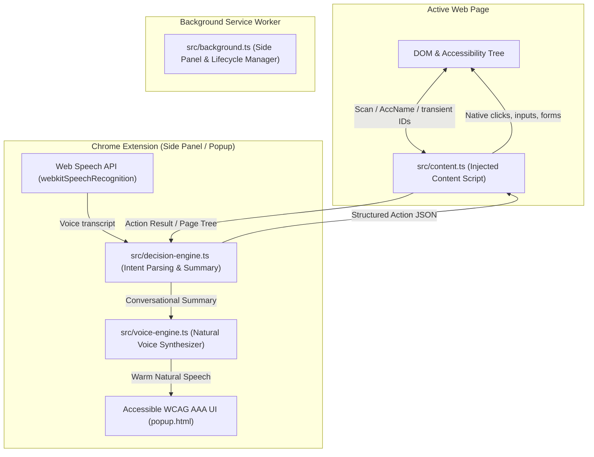

# a11y-pilot 🎙️♿

> **Production-Ready Conversational Voice-Controlled Chrome Extension (Manifest V3)**  
> Built with **100% Pure TypeScript 7 (Strict Mode)**, **Vite 8**, **pnpm**, and the **Web Speech API**.

---

## 🎯 Core Mission

Instead of injecting clunky DOM overlays or rewriting web page markup, **a11y-pilot** inspects the page's interactive accessibility hierarchy, summarizes available actions in warm conversational language, and empowers users with visual impairments or motor disabilities to browse and trigger actions naturally through voice commands.

---

## 🏗️ Architecture & Tech Stack



1. **Manifest V3 Core**:
   - `activeTab`, `scripting`, `sidePanel` permissions.
   - Dual interface: supports modern **Chrome Side Panel** (stays pinned during navigation) with **Popup fallback**.
2. **Pure TypeScript 7 & Strict Mode**:
   - Strict compiler mode enabled (`strict: true`, `noImplicitAny: true`, `strictNullChecks: true`, `noUnusedLocals: true`, `allowImportingTsExtensions: true`).
   - Zero loose legacy `.js` files in source.
3. **Vite 8 Bundling**:
   - Multi-entry point bundling with relative asset resolution (`base: './'`).
   - Sub-80ms production build times.
4. **Voice Engine (`src/voice-engine.ts`)**:
   - Asynchronous discovery with `voiceschanged` event handling.
   - **Strict Natural Voice Hierarchy (Non-Robotic & Free)**:
     1. Microsoft "Natural" neural voices (e.g. *Microsoft Aria Online Natural*, *Microsoft Guy Online Natural*).
     2. Google Natural neural voices (*Google US English*, *Google UK English Female*).
     3. OS Enhanced / Premium voices (*Samantha Enhanced*, *Daniel Enhanced*).
     4. System fallback.
   - Calibrated **Rate (0.95)** and **Pitch (1.0)** to eliminate mechanical cadence.
   - **Clean Interruption Handling**: Instantly cancels ongoing speech when the user begins speaking.
5. **Page Accessibility Inspector (`src/content.ts`)**:
   - Extracts **ONLY** actionable interactive elements: `button`, `link`, `searchbox`, `textbox`, `combobox`, `checkbox`.
   - Computes compliant accessible names following **W3C AccName 1.2** specification.
   - Assigns transient unique `data-agent-id` badges (`1, 2, 3...`) for direct voice targeting.
   - Dispatches native synthetic events (supporting React, Vue, Angular synthetic event loops).
6. **Decision Engine (`src/decision-engine.ts`)**:
   - Generates warm, conversational summaries (e.g., *"You are on Amazon. Would you like to search for a product or view your cart?"*).
   - Maps user utterances to structured JSON actions (`fill_and_submit`, `click`, `fill`, `scroll`, `cancel`).

---

## 📁 Clean Project Structure

```
├── .agents/
│   └── skills/
│       └── karpathy-guidelines/   # Antigravity project skill
├── public/
│   ├── manifest.json              # Chrome MV3 manifest
│   └── icons/                     # Generated PNG extension icons (16, 48, 128)
├── src/
│   ├── types/
│   │   └── index.ts               # Strict TypeScript interfaces & message types
│   ├── voice-engine.ts            # Natural TTS synthesis & interruption queue
│   ├── decision-engine.ts         # Natural language intent parser & summarizer
│   ├── content.ts                 # Page inspector, AccName parser, native executor
│   ├── popup.ts                   # Primary controller for speech recognition & UI
│   └── background.ts              # MV3 background worker (Side Panel manager)
├── scripts/
│   └── generate-icons.ts          # Pure TypeScript icon generator (zlib/png)
├── tests/
│   ├── decision-engine.test.ts    # Intent dispatcher & summary unit tests
│   └── voice-engine.test.ts       # Voice hierarchy & sentence chunking tests
├── popup.html                     # WCAG 2.1 AAA accessible interface
├── popup.css                      # Accessible theme with dark mode & high contrast
├── tsconfig.json                  # TypeScript 7 strict compiler configuration
├── vite.config.ts                 # Vite 8 multi-target extension bundler
└── package.json                   # Scripts and dependencies
```

---

## 🚀 Quick Start

### 1. Prerequisites
- **Node.js**: v22+ (tested on Node v24)
- **pnpm**: v10+

### 2. Install Dependencies
```bash
pnpm install
```

### 3. Build Extension
```bash
pnpm build
```
This runs `tsc --noEmit` and bundles production assets into `dist/`.

### 4. Run Tests & Typecheck
```bash
# Run unit tests using Node's native test runner
pnpm test

# Run strict TypeScript typecheck
pnpm typecheck
```

### 5. Generate Extension Icons (Pure TypeScript)
```bash
pnpm generate:icons
```

---

## 🌐 Loading into Chrome

1. Open Chrome and navigate to `chrome://extensions/`.
2. Toggle on **Developer mode** in the top right corner.
3. Click **Load unpacked**.
4. Select the `dist/` directory generated by `pnpm build`.
5. Click the **a11y-pilot** icon in the Chrome toolbar to open the Side Panel / Popup.

---

## 🗣️ Supported Conversational Flow & Voice Commands

| User Voice Command | Decision Engine Intent | Action Dispatched to Page |
| :--- | :--- | :--- |
| *"Search for vintage jackets"* | `SEARCH` | `fill_and_submit` on searchbox (ID: 1) with `"vintage jackets"` |
| *"Click cart"* / *"View cart"* | `CLICK` | `click` on button matching "cart" |
| *"Click 2"* / *"Number 3"* | `CLICK_BY_ID` | `click` on element by transient ID |
| *"Type aymen@example.com in Email"* | `FILL` | `fill` on input field matching "Email" |
| *"Scroll down"* / *"Scroll up"* | `SCROLL` | Smooth scroll 75% of viewport |
| *"What can I do?"* / *"Where am I?"* | `SUMMARY` | Conversational spoken summary of site & actions |
| *"Stop"* / *"Quiet"* | `CANCEL` | Instantly aborts speech output |

---

## ♿ Accessibility Compliance
- **WCAG 2.1 AAA Contrast**: Meets 7:1 contrast ratios for text and UI indicators.
- **ARIA Live Regions**: Real-time status updates (`aria-live="polite"`) and priority alerts (`aria-live="assertive"`).
- **Keyboard Navigation**: Full keyboard operability (`Space` to toggle mic, `Escape` to close modals, `Tab` order managed).
- **Focus Rings**: High-contrast, non-intrusive focus rings on active elements during voice execution.

---

## 📜 License
Licensed under the [Apache License, Version 2.0](LICENSE).
