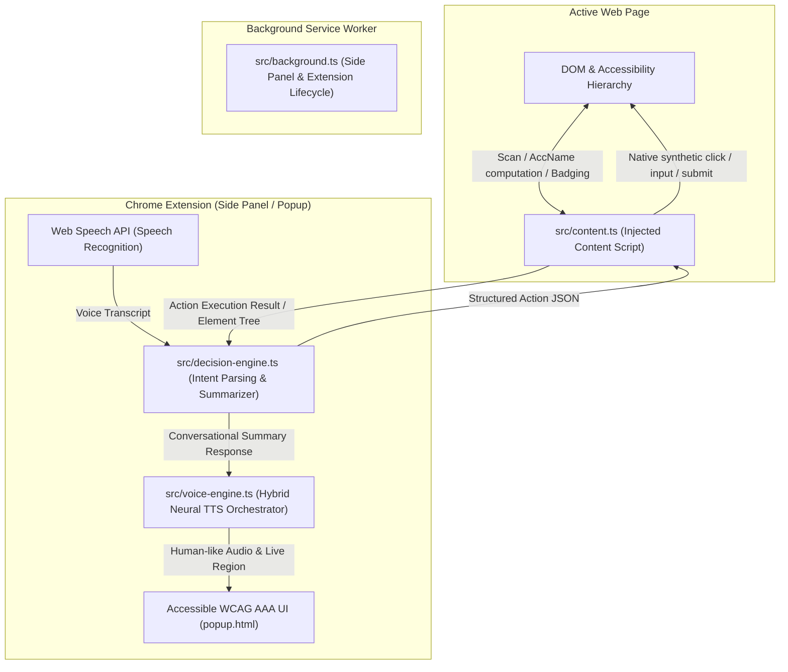

<div align="center">
  
  <h1>a11y-pilot</h1>
  <p><strong>Conversational Voice-Controlled Chrome Extension (Manifest V3)</strong></p>
  <p><em>Designed to be simple, accessible, and understandable for everyone.</em></p>
</div>

---

## ⚡ Super-Quick Start (From Zero to Running in Chrome)

> [!NOTE]
> Designed for ease of use! If you are participating in the hackathon, using a screen reader, or have any accessibility needs, follow these step-by-step commands to get the extension up and running in less than 2 minutes.

### 1. Copy & Run These Commands in Your Terminal

```bash
# Step 1: Clone the repository
git clone https://github.com/Soussi-Aymen/access-web-extension.git

# Step 2: Enter the project folder
cd access-web-extension

# Step 3: Install dependencies (pnpm or npm)
pnpm install
# Note: If you do not have pnpm installed, run: npm install -g pnpm

# Step 4: Build the project (creates the 'dist' folder)
pnpm build
```

---

### 2. How to Load the `dist/` Folder into Google Chrome

1. **Open Google Chrome** and in the address bar, type or paste:
   ```text
   chrome://extensions/
   ```
   and press <kbd>Enter</kbd>.
2. Look at the **top right corner** and switch on the **Developer mode** toggle.
3. Look at the **top left corner** and click the button labeled **Load unpacked**.
4. In the file picker that opens, navigate into `access-web-extension` and select the **`dist`** folder, then click **Select Folder** (or **Open**).
5. **Done!** You will see **a11y-pilot** appear in your extension list.
6. Click the Extensions puzzle piece icon on your Chrome toolbar, pin **a11y-pilot**, and click it to open the voice panel!

---

### 3. 🎤 Enable Microphone Access (One-Time Setup)

To allow **a11y-pilot** to listen to your voice:

1. In Google Chrome, go to:
   ```text
   chrome://settings/content/microphone
   ```
2. Make sure **"Sites can ask to use your microphone"** is selected.
3. Under **"Allowed to use your microphone"**, find **a11y-pilot** (or its extension ID) and set it to **Allow**.
4. You're all set! Now you can click **"Start Listening"** (or press <kbd>Space</kbd>) and talk naturally to browse.

---

## 💡 What is a11y-pilot? (Quick Summary)

**a11y-pilot** allows anyone to browse websites and trigger actions entirely using natural voice conversation. 

Instead of cluttering web pages or forcing you to memorize complex hotkeys, **a11y-pilot**:
- 🎧 **Listens** to natural speech (e.g. *"Search for running shoes"*, *"Click cart"*, *"What can I do on this page?"*).
- 🔍 **Inspects** the webpage's accessibility tree (buttons, search bars, links, inputs).
- 🗣️ **Speaks back** in warm, natural human speech with full screen-reader friendly feedback.
- ⚡ **Executes** actions directly on the page seamlessly.

### Core Techniques Used
- **Edge Natural Neural TTS + Web Speech Synthesis**: Gives warm, non-robotic conversational voices (free with zero API key requirement).
- **W3C AccName 1.2 Interactive Element Inspector**: Extracts meaningful labels and interactive controls without disturbing the original page layout.
- **Natural Language Intent Matching**: Maps human everyday phrasing to browser interactions (`SEARCH`, `CLICK`, `FILL`, `SCROLL`, `SUMMARY`).
- **WCAG 2.1 AAA High-Contrast UI**: Designed with high contrast, scalable typography, keyboard shortcuts, and full screen-reader live alerts.

---

## 🛠️ Deep Technical Details & Architecture



### 1. Dual Speech Engine Architecture (`src/voice-engine.ts`)
- **Tier 1 (Edge Neural Audio via WebSocket)**: Synthesizes high-fidelity Microsoft Neural voices (`en-US-AriaNeural`, `en-US-GuyNeural`, `en-GB-SoniaNeural`) using SSML and cryptographic DRM token generation (`Sec-MS-GEC`).
- **Tier 2 (Google Neural Web TTS & Web Speech API)**: Lightweight chunked fallback ensuring crisp vocal output without mechanical artifacting across any platform.
- **Interruption Queueing**: Instant cancellation of audio output as soon as speech recognition detects user voice input.

### 2. Semantic Accessibility Tree Inspector (`src/content.ts`)
- Implements the **W3C AccName 1.2** specification:
  - Traverses `aria-labelledby`, `aria-label`, `<label for="...">`, element text content, and `title`/`placeholder` attributes.
  - Filters strictly for actionable elements: `button`, `link`, `searchbox`, `textbox`, `combobox`, `checkbox`.
  - Dispatches native browser events (`InputEvent`, `MouseEvent`, `Event('change', { bubbles: true })`) to trigger React, Vue, Angular, and Svelte component state updates.

### 3. Intent & Decision Engine (`src/decision-engine.ts`)
- Maps spoken user utterances into discrete executable actions:
  - `SEARCH`: Identifies search input fields, types queries, and dispatches form submission.
  - `CLICK`: Fuzzy matches element labels or targeted numbers (e.g., *"Click 2"*).
  - `FILL`: Directs input values to appropriate textboxes.
  - `SCROLL`: Dispatches smooth relative scrolling.
  - `SUMMARY`: Produces conversational overview of the active page.
  - `CANCEL`: Silences audio output immediately.

---

## 📂 Project Structure

```
├── public/
│   ├── manifest.json              # Chrome MV3 manifest
│   └── icons/                     # Generated extension icons (16, 48, 128)
├── src/
│   ├── types/
│   │   └── index.ts               # Strict TypeScript interfaces & messages
│   ├── voice-engine.ts            # Natural TTS synthesis & interruption queue
│   ├── google-tts.ts              # Neural web TTS client with sentence chunking
│   ├── decision-engine.ts         # Natural language intent parser & summarizer
│   ├── content.ts                 # Page inspector, AccName parser, native executor
│   ├── popup.ts                   # UI controller, mic toggle & audio feedback
│   └── background.ts              # MV3 service worker (Side panel manager)
├── tests/
│   ├── decision-engine.test.ts    # Intent dispatcher & summary unit tests
│   └── voice-engine.test.ts       # Voice hierarchy & sentence chunking tests
├── popup.html                     # Accessible UI (High contrast, screen reader ready)
├── popup.css                      # WCAG AAA compliant styles
├── tsconfig.json                  # TypeScript 7 strict configuration
├── vite.config.ts                 # Vite 8 multi-entry bundler
└── package.json                   # Dependencies and npm scripts
```

---

## 🗣️ Supported Voice Commands

| Voice Command | Action |
| :--- | :--- |
| *"Search for vintage jackets"* | Fills searchbox and triggers search |
| *"Click cart"* / *"Open settings"* / *"Click bag"* | Clicks matching control using semantics and synonyms |
| *"Click 2"* / *"Select number 3"* | Targets item directly by its transient ID badge |
| *"Type aymen@example.com in Email"* | Fills the specific form field |
| *"Scroll down"* / *"Scroll up"* / *"Top"* / *"Bottom"* | Smoothly scrolls the viewport |
| *"Where am I?"* | Heuristic summary of page title, landmarks, headings, counts, and snippet |
| *"What can I do?"* / *"Help"* | Speaks a conversational summary of primary actions |
| *"Click cart and then scroll down"* | Chains multiple commands sequentially with page settle |
| *"Next heading"* / *"Previous heading"* | Cycles focus and scrolls to heading elements |
| *"Next link"* | Cycles focus and scrolls to link elements |
| *"List landmarks"* | Speaks all ARIA landmarks detected on the page |
| *"Go to main"* / *"Go to navigation"* | Moves focus and jumps directly to specified landmark |
| *"Remember this as [name]"* | Starts recording voice commands into a macro |
| *"Stop remembering"* | Saves current recorded commands as a named macro |
| *"Run [name]"* | Replays saved macro commands through standard matching |
| *"List macros"* | Speaks all saved macro names |
| *"Delete macro [name]"* | Removes a saved macro from storage |
| *"Stop"* / *"Quiet"* | Immediately cancels speech |

---

## ⚠️ Known Limitations

- **Speech Recognition Processing**: Browser speech recognition (`webkitSpeechRecognition`) is provided natively by Google Chrome and may send audio to Google servers for transcription depending on the operating system and browser configuration.
- **No AI Model or Cloud LLM**: All intent parsing, synonym expansion, page summarization, candidate ranking, and macro execution are built purely with deterministic, lightweight TypeScript heuristics without any AI model or LLM API calls.

---

## 🤝 Contributing & Developer Commands

We welcome contributions from everyone! All commands are kept simple and standard:

```bash
# Run unit tests
pnpm test

# Check TypeScript types strictly
pnpm typecheck

# Build for production
pnpm build
```

---

## 📜 License
Licensed under the [Apache License, Version 2.0](LICENSE).
